# 群晖docker安装gsetant,并启用AdultScraperX
    最近刚好扩容硬盘所以就重新安装了plex,折腾了一下新版gsetant,简单使用了一下，推荐使用新版,以后随着功能丰富一定是会更加方便的。建议通读一下再动手安装；

## 整理思路
    - 服务端安装方式（请自行选择）:
        - 第一种(小白): 通过docker群晖端页面进行安装,并配置相应参数,启动服务；
        - 第二种: 通过小哥写的docker-compose进行安装,群晖已经帮我们安装好了docker-compose, 使用docker-compose只需要通过ssh登录群晖terminal便可以使用；
    - 待服务启动成功以后,通过服务端页面添加插件和其他配置信息;
    - 配置完成，plex安装gsetant插件,链接服务端即可使用;

## 第一种方式 （插件中心安装docker过程，略）
- 第一步：通过页面下载镜像文件,选择注册表,在搜索栏输入镜像名称即可，需要保证你的nas可以联网，这里本质是那个是去hub.docker.com，通过docker pull images 去下载的镜像；
### 双击搜索到的gstant镜像仓库,选择标签,按照群主的文档意思，这两个tag都可以，我用的是latest的版本；
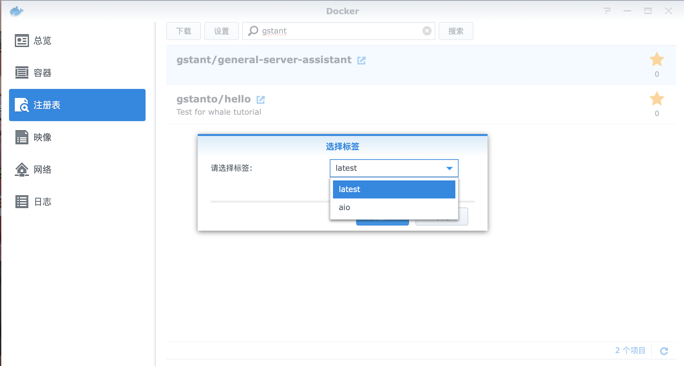

### 安装mongo,这里的一定不要选5.0以后的版本，要不然群晖会报错的,因为5.0以后添加了获取CPU方面额外的参数，跟VM相关的，貌似群晖不支持,没有深究。安安心心用5.0以前的tag就行了，我用的是4.0.
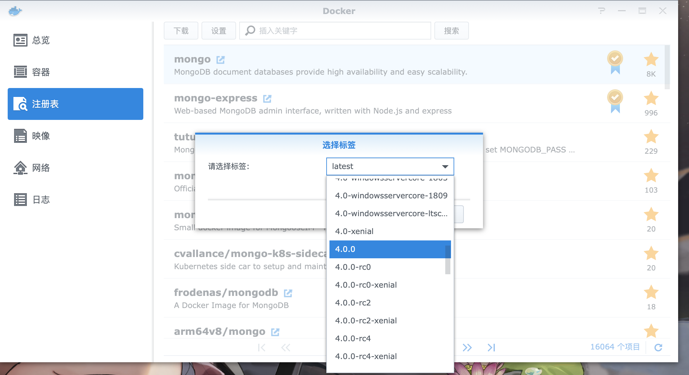

- 第二步：下载完上述镜像，我们需要启动他，就行你下载了一个exe文件，需要安装以后双击启动一样，镜像只有run起来成为容器，我们才能像使用程序一样使用他们。
### 镜像下载完成页面
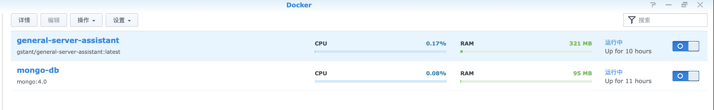

### Mongo镜像启动，需要写入的参数
## 启动容器,选中映像中的你想启动的容器,点击“启动”
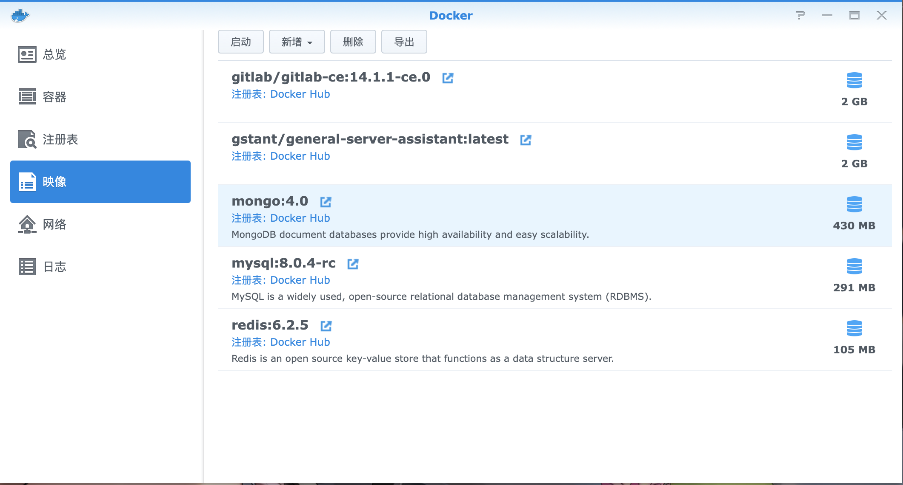

## 启动后，会出现下面的页面，选择高级设置，然后详细设置可以参考的我下面用配置
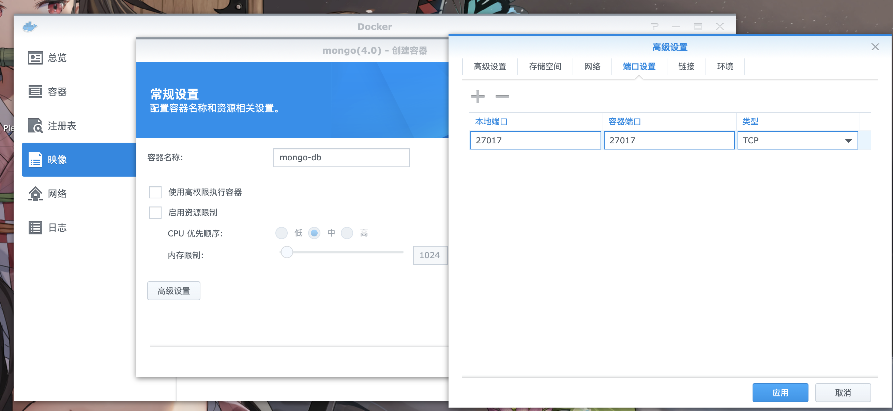

## 配置端口:27017->27017
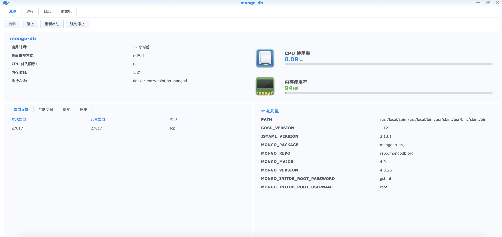

## 配置外挂存储，我给放到docker的文件夹下面了，理论上任意位置都可以，要给docker读写权限就行了。
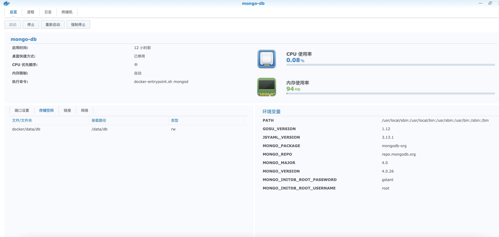

## 配置环境变量

### Gstant镜像启动，需要写入的参数
## 和上面一样，我只给出我的配置，可以直接用：
## 配置端口：9999 -> 9999
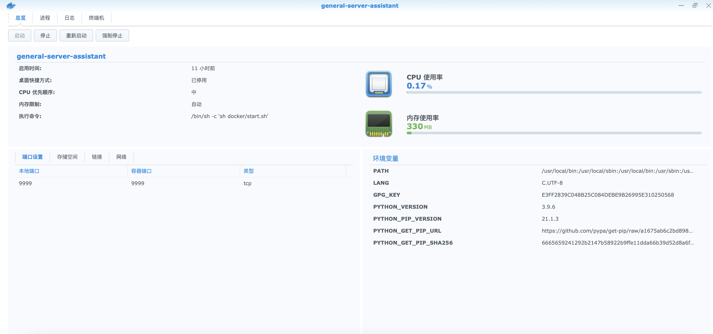

## 配置外挂存储，我给放到docker的文件夹下面了，理论上任意位置都可以，要给docker读写权限就行了。
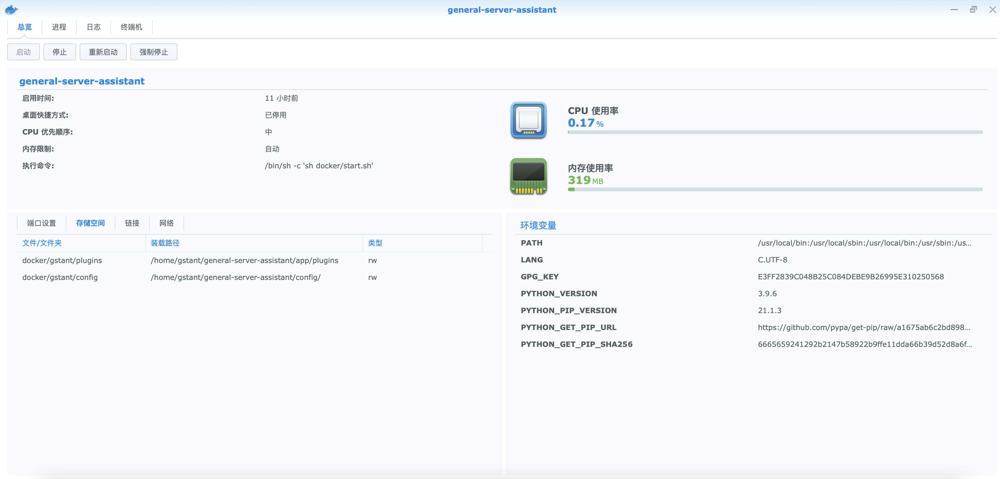

## 配置容器依赖,目的是容器之间可以不通过外部暴露就可以使用对应的端口
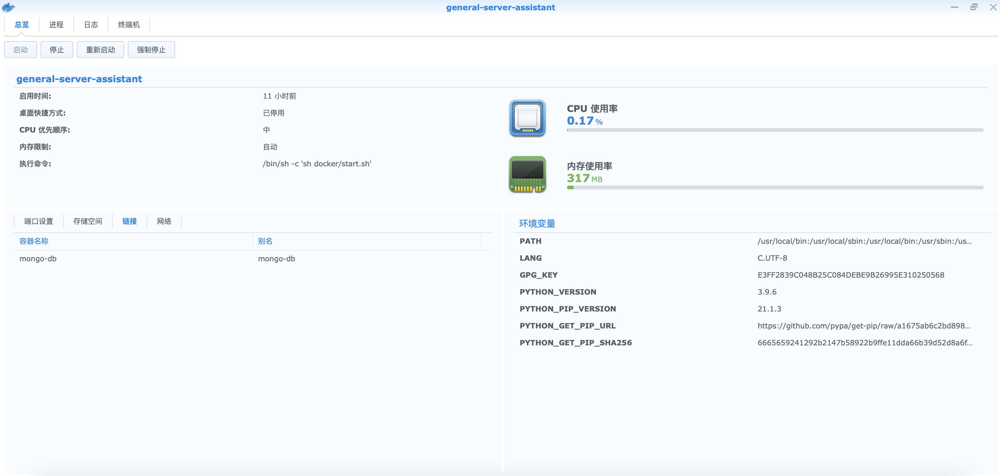

# 如果上面都配置完成，如果都用我的配置，一定是可以启动起来的，如果不能起来，在容器->详情->日志里面把错误日志发到群里，会有热心大神帮助解决。
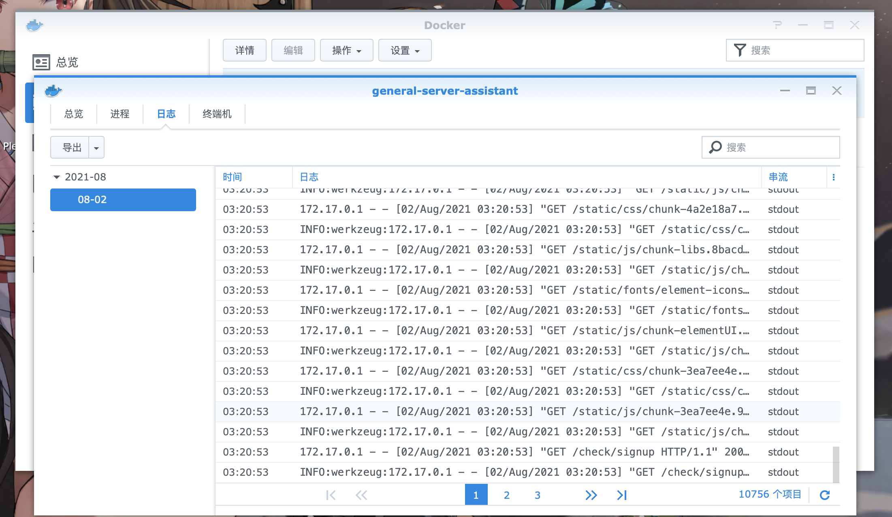

## 第二种方式
### 通过SSH链接到群晖的terminal，通过docker-compose启动，请修改docker-compose.yml中对应的镜像版本，其他的都不用改了，然后docker-compose up -d 就可以启动了，docker-compose就是一个脚本，可以帮你完成第一种方式的一系列操作。
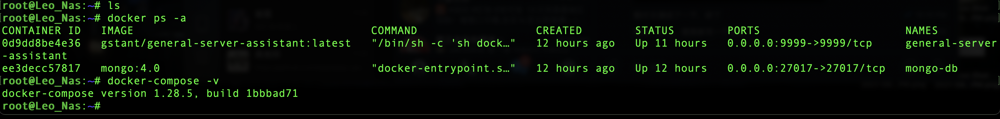

---

## 服务端页面配置

### 个人中心生成新的密函，以后plex插件链接server鉴权用的
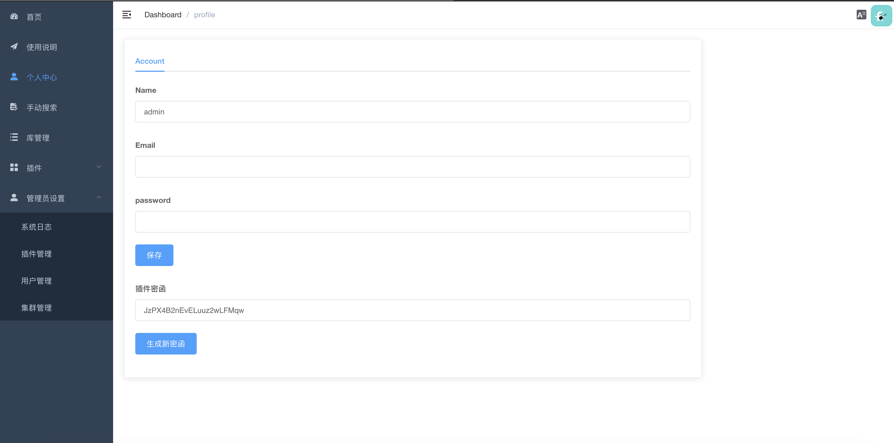

### 新增插件,地址：https://github.com/gsetant/adultscraperx
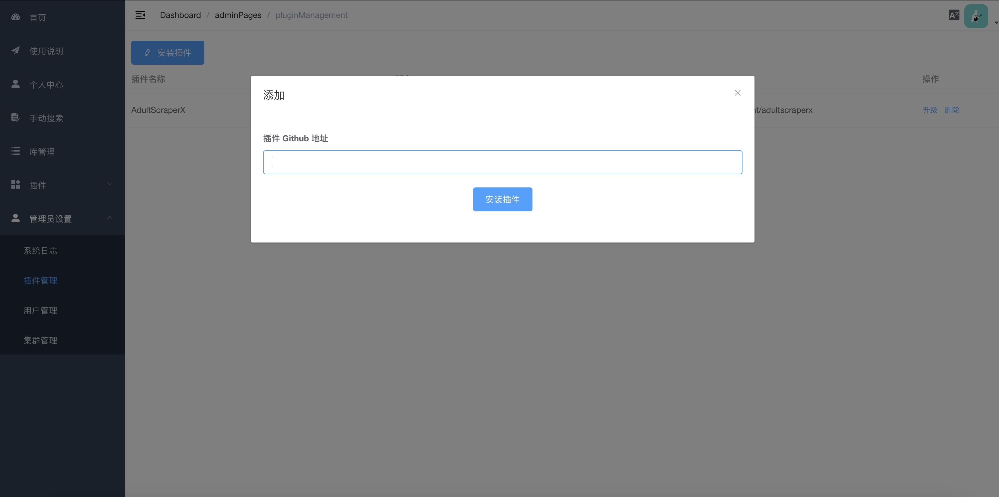

### 启动插件
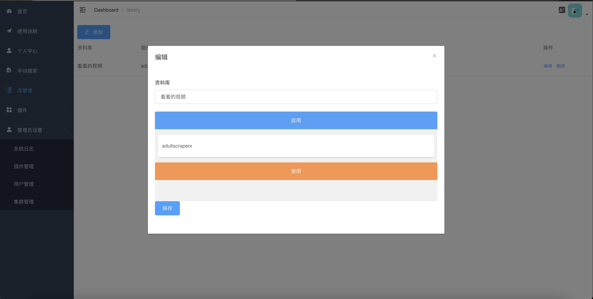

### 插件设置
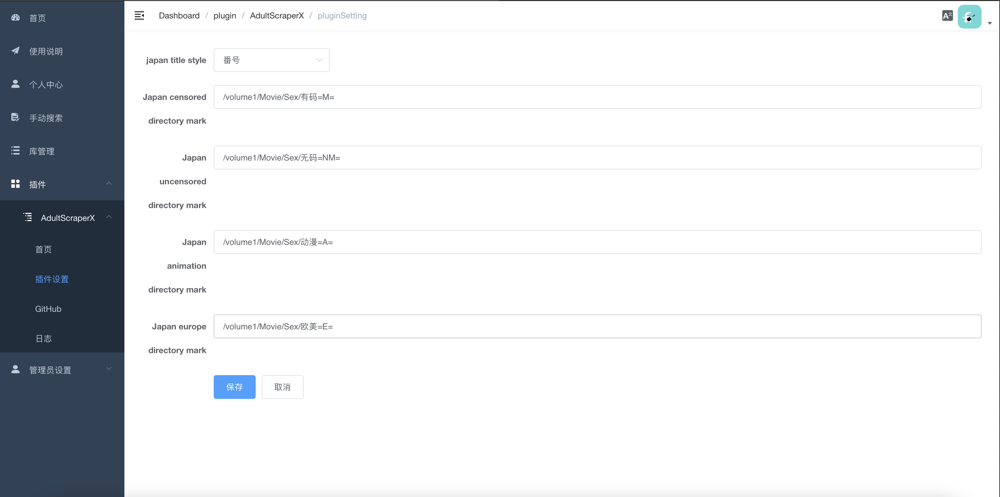

### 设置库管理

## plex插件安装及配置
## 添加一个扫描的库
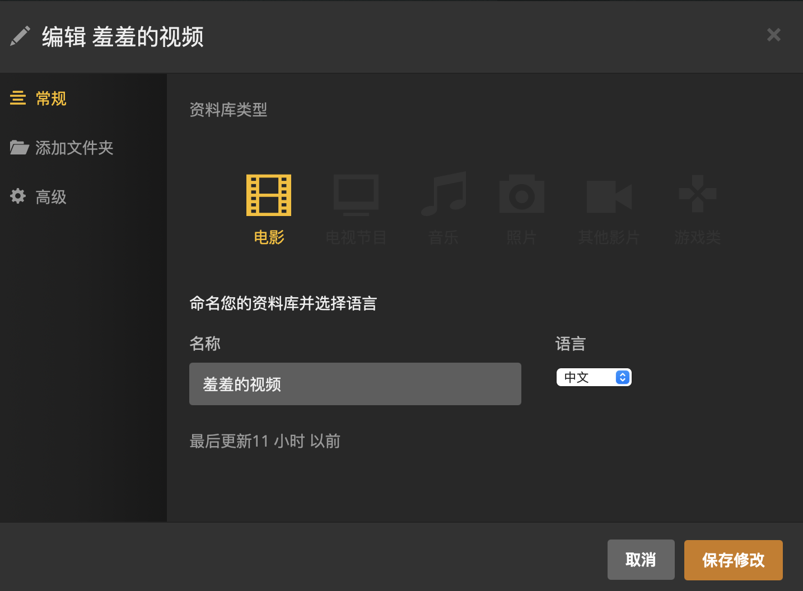

## 配置路径
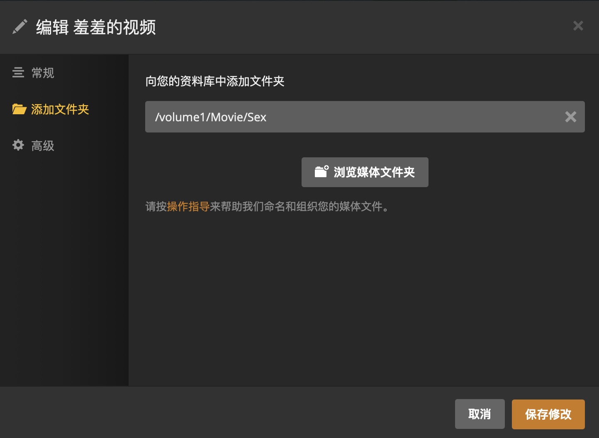

## 配置代理,本地服务器 127.0.0.1:9999
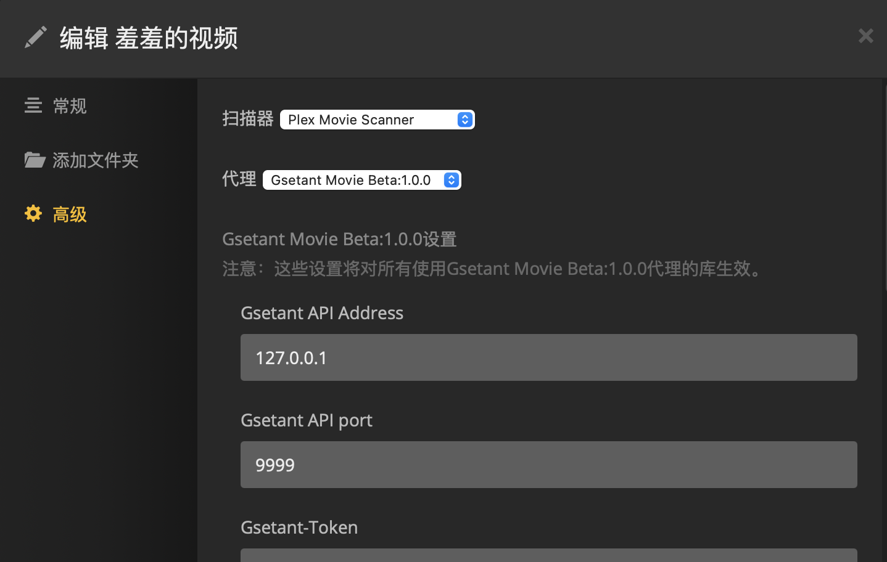

## 开心的使用吧